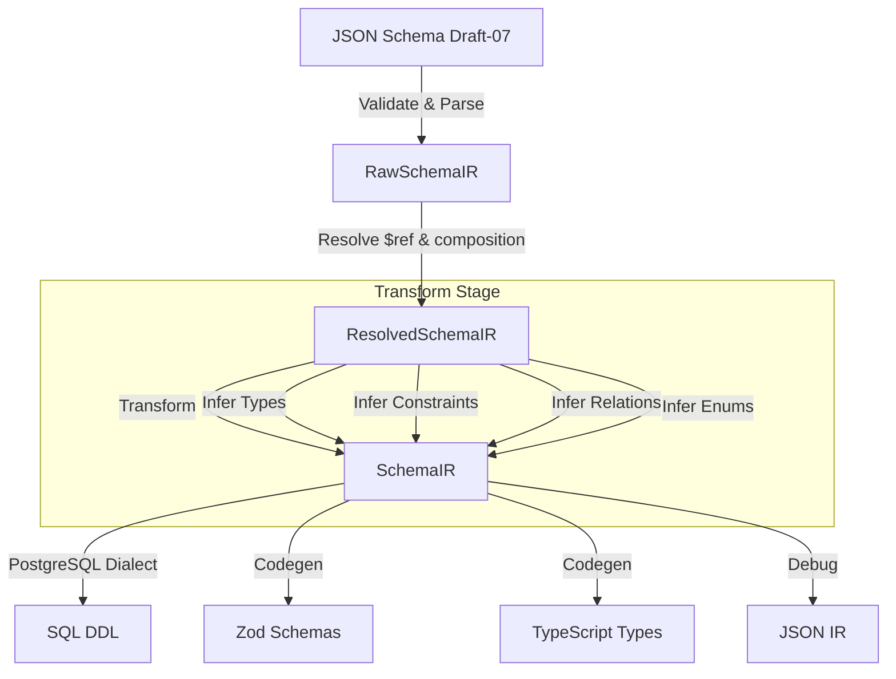

# schemarr

> Transform JSON Schema to SQL DDL, TypeScript types, and Zod validators

[](https://www.typescriptlang.org/)
[](https://bun.sh)
[](https://opensource.org/licenses/MIT)

## What is Schemarr?

Schemarr bridges the gap between API specifications (JSON Schema) and database implementation. Define your data model once in JSON Schema Draft-07, and generate:

- **SQL DDL** for your database (PostgreSQL supported, extensible dialect system)
- **TypeScript types** matching your schema
- **Zod validation schemas** for runtime validation
- **Debug intermediate representation** for inspection

Eliminate schema drift between your APIs and databases with a single source of truth.

## Features

- ✅ **JSON Schema Draft-07** support with `$ref` resolution
- ✅ **Multi-target generation** from a single schema
- ✅ **Smart relation inference** (one-to-one, one-to-many, many-to-many)
- ✅ **Automatic type mapping** (JSON types → SQL types)
- ✅ **Constraint extraction** (PK, FK, UNIQUE, CHECK)
- ✅ **Custom naming strategies** (PascalCase → snake_case by default)
- ✅ **Extension properties** for SQL-specific features (`x-relation`, `x-on-delete`, `x-unique`)
- ✅ **Zod schema support** - Convert Zod schemas to SQL DDL, TypeScript types, or normalized Zod code
- ✅ **Watch mode** for development workflow
- ✅ **CLI and programmatic API**

## Installation

```bash
# CLI
bun install -g schemarr

# Library
bun add schemarr
```

## Quick Start

**Input** (`schema.json`):

```json
{
  "$schema": "http://json-schema.org/draft-07/schema#",
  "title": "Post",
  "type": "object",
  "required": ["id", "title", "author"],
  "properties": {
    "id": {
      "type": "string",
      "format": "uuid"
    },
    "title": {
      "type": "string",
      "maxLength": 500
    },
    "author": {
      "$ref": "#/definitions/Author"
    }
  },
  "definitions": {
    "Author": {
      "title": "Author",
      "type": "object",
      "required": ["id", "username"],
      "properties": {
        "id": {
          "type": "string",
          "format": "uuid"
        },
        "username": {
          "type": "string",
          "maxLength": 100
        }
      }
    }
  }
}
```

**Generate SQL**:

```bash
schemarr convert schema.json -f sql -o schema.sql
```

**Output**:

```sql
CREATE TABLE "author" (
  "id" UUID NOT NULL,
  "username" VARCHAR(100) NOT NULL,
  CONSTRAINT "author_pkey" PRIMARY KEY ("id")
);

CREATE TABLE "post" (
  "id" UUID NOT NULL,
  "title" VARCHAR(500) NOT NULL,
  "author_id" UUID NOT NULL,
  CONSTRAINT "post_pkey" PRIMARY KEY ("id"),
  CONSTRAINT "post_author_id_fkey" FOREIGN KEY ("author_id") REFERENCES "author" ("id")
);

CREATE INDEX "post_author_id_idx" ON "post" USING btree ("author_id");
```

## CLI Usage

```bash
# Interactive wizard
schemarr init

# Convert to SQL
schemarr convert schema.json -f sql -d postgres -o schema.sql

# Convert to Zod
schemarr convert schema.json -f zod -o validation.ts

# Convert to TypeScript types
schemarr convert schema.json -f typescript -o types.ts

# Convert from Zod schema to SQL
schemarr convert schema.ts --input-format zod -f sql -o schema.sql

# Watch mode for development
schemarr convert schema.json -o schema.sql --watch

# Read from stdin
echo '{"title":"User"}' | schemarr convert - -f sql
```

## Programmatic API

```typescript
import {
  convert,
  convertToIR,
  convertToZod,
  convertToTypes,
  convertZodToSql,
  convertZodToTypes,
  convertZodToIR,
  postgresDialect,
} from 'schemarr';

// Convert JSON Schema to SQL
const result = convert(schema, {
  dialect: postgresDialect,
  inlineObjectStrategy: 'jsonb',
  defaultArrayRefRelation: 'one_to_many',
});

if (result.kind === 'ok') {
  console.log(result.value);
}

// Convert Zod schema to SQL
const zodResult = await convertZodToSql(schema, {
  dialect: postgresDialect,
  inlineObjectStrategy: 'jsonb',
  defaultArrayRefRelation: 'one_to_many',
});

if (zodResult.kind === 'ok') {
  console.log(zodResult.value);
}

// Convert JSON Schema to Zod
const zodResult = convertToZod(schema, options);

// Convert JSON Schema to TypeScript types
const tsResult = convertToTypes(schema, options);

// Convert Zod schema to TypeScript types
const zodTsResult = await convertZodToTypes(schema);

// Get intermediate representation for debugging
const irResult = convertToIR(schema, options);

// Get intermediate representation from Zod schema
const zodIrResult = await convertZodToIR(schema);
```

### Zod Schema Support

You can now convert Zod schemas directly to SQL, TypeScript, or normalized Zod code:

```typescript
import { z } from 'zod';
import { convertZodToSql, postgresDialect } from 'schemarr';

const UserSchema = z.object({
  id: z.uuid(),
  name: z.string(),
  email: z.email(),
});

const sql = await convertZodToSql(UserSchema, {
  dialect: postgresDialect,
});

console.log(sql);
```

**CLI usage for Zod schemas:**

```bash
schemarr convert schema.ts --input-format zod -f sql
schemarr convert schema.ts --input-format zod -f typescript
schemarr convert schema.ts --input-format zod --export UserSchema -f sql
```

**Zod schema metadata:**

Use `.meta()` to add SQL hints to your Zod schema:

```typescript
const schema = z
  .object({
    userId: z.string(),
  })
  .meta({
    'x-relation': 'one-to-many',
    'x-on-delete': 'CASCADE',
  });
```

## How It Works

Schemarr uses a multi-stage pipeline architecture:



### Stage 1: Parser

Validates JSON Schema structure and extracts root definitions into `RawSchemaIR`.

### Stage 2: Resolver

Resolves all `$ref` pointers (including circular references) and handles `allOf`/`oneOf` compositions.

### Stage 3: Transform

Infers SQL types, constraints, relationships, and enums from the resolved schema.

### Stage 4: Emitter

Emits the intermediate representation to target formats using dialect-specific or codegen strategies.

## Configuration Options

```typescript
interface ConvertOptions {
  dialect: SqlDialect;
  inlineObjectStrategy?: 'jsonb' | 'separate_table';
  defaultArrayRefRelation?: 'one_to_many' | 'many_to_many';
  naming?: Partial<NamingStrategy>;
}
```

### Object Strategy

- `'jsonb'` (default): Nested objects become JSONB columns with preserved schema structure
- `'separate_table'`: Nested objects become separate tables with foreign keys

### Array Reference Relations

- `'one_to_many'` (default): Arrays of `$ref` create FK on child table
- `'many_to_many'`: Arrays of `$ref` create join tables

### Custom Naming

Override default naming strategy (PascalCase → snake_case):

```typescript
const naming = {
  tableName: (name) => `tbl_${name.toLowerCase()}`,
  columnName: (name) => name.toUpperCase(),
};
```

## Relation Inference

Schemarr automatically detects relationships from schema structure:

```json
{
  "properties": {
    "author": {
      "$ref": "#/definitions/Author"
    },
    "comments": {
      "type": "array",
      "items": {
        "$ref": "#/definitions/Comment"
      }
    },
    "tags": {
      "type": "array",
      "items": {
        "$ref": "#/definitions/Tag"
      },
      "x-relation": "many-to-many"
    }
  }
}
```

- **Single `$ref`** → Foreign key on source table
- **Array of `$ref`** → Foreign key on child table (one-to-many)
- **`x-relation: "many-to-many"`** → Join table with two foreign keys

## Extension Properties

Use `x-*` properties for SQL-specific features:

```json
{
  "properties": {
    "organization_id": {
      "type": "string",
      "format": "uuid",
      "$ref": "#/definitions/Organization",
      "x-relation": "one-to-many",
      "x-on-delete": "CASCADE",
      "x-on-update": "CASCADE"
    },
    "slug": {
      "type": "string",
      "x-unique": true
    }
  }
}
```

- `x-relation`: Explicitly specify relationship type
- `x-on-delete`/`x-on-update`: FK cascade behavior
- `x-unique`: Add unique constraint

## Type Mapping

| JSON Type/Format       | PostgreSQL Type           |
| ---------------------- | ------------------------- |
| `string` + `uuid`      | UUID                      |
| `string` + `date-time` | TIMESTAMPTZ               |
| `string` + `date`      | DATE                      |
| `string` + `email`     | TEXT                      |
| `string` + `uri`       | TEXT                      |
| `string` + `maxLength` | VARCHAR(n)                |
| `integer`              | INTEGER                   |
| `integer` + `int64`    | BIGINT                    |
| `number`               | DOUBLE PRECISION          |
| `boolean`              | BOOLEAN                   |
| `array`                | PostgreSQL array          |
| `enum`                 | Custom ENUM type          |
| `object`               | JSONB (or separate table) |

## Contributing

Contributions are welcome! Please read our contributing guidelines before submitting PRs.

## License

MIT © [Your Name]
